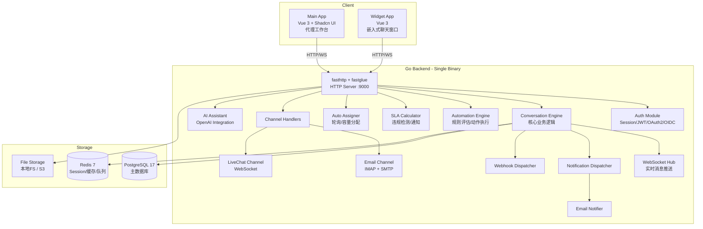

# LibreDesk 项目结构文档

## 1. 项目概览

**LibreDesk** 是一个现代化、开源、可自托管的全渠道客户支持平台。它将实时聊天、电子邮件等渠道统一整合到一个收件箱中，并以**单一二进制文件**形式分发（通过 stuffbin 将前端静态资源嵌入 Go 二进制）。

- **后端语言**: Go 1.25
- **前端框架**: Vue.js 3 + Shadcn UI (基于 Radix Vue)
- **数据库**: PostgreSQL 17
- **缓存/会话**: Redis 7
- **HTTP 框架**: fasthttp (zerodha/fastglue)
- **配置格式**: TOML (koanf)
- **构建工具**: Make + stuffbin (静态资源嵌入)
- **包管理**: pnpm (前端) / Go Modules (后端)
- **开源协议**: 参见 LICENSE 文件

---

## 2. 顶层目录结构

```
libredesk/
├── cmd/                    # Go 后端入口及 HTTP 处理器（主程序包）
├── internal/               # Go 核心业务逻辑（内包，不可外部导入）
├── frontend/               # Vue.js 3 前端项目
├── i18n/                   # 国际化翻译文件 (JSON)
├── static/                 # 静态资源（邮件模板、Web 模板、CSS、Widget JS）
├── schema.sql              # 数据库初始化 SQL（DDL + 枚举类型定义）
├── config.sample.toml      # 配置文件模板
├── docker-compose.yml      # Docker Compose 编排文件
├── Dockerfile              # 容器镜像构建文件
├── Makefile                # 构建、运行、测试命令
├── go.mod / go.sum         # Go 模块依赖
├── .goreleaser.yaml        # GoReleaser 发布配置
├── VERSION                  # Git 版本占位文件
├── README.md               # 项目说明
├── CONTRIBUTING.md         # 贡献指南
├── ROADMAP.md              # 项目路线图
├── SECURITY.md             # 安全策略
├── LICENSE                 # 开源协议
└── .github/                # GitHub Actions CI/CD 工作流
```

---

## 3. 后端架构 (`cmd/`)

`cmd/` 是整个应用的入口点，包含 `main()` 函数和所有 HTTP 处理器。所有文件属于 `package main`。

| 文件 | 职责 |
|------|------|
| `main.go` | 应用启动入口，信号处理、优雅关闭 |
| `init.go` | 初始化：配置加载、数据库连接、Redis 连接、各模块实例化、路由注册 |
| `handlers.go` | 通用 HTTP 处理器（首页、静态文件等） |
| `install.go` | 数据库安装（`--install` 命令） |
| `upgrade.go` | 数据库迁移升级（`--upgrade` 命令） |
| `config.go` | 命令行参数解析及配置加载 |
| `middlewares.go` | HTTP 中间件（认证、权限、CORS 等） |
| **业务处理器** | |
| `auth.go` | 认证相关 API（登录、登出、Token 刷新） |
| `login.go` | 登录页面渲染 |
| `oauth.go` | OAuth2 认证流程 |
| `oidc.go` | OpenID Connect 认证 |
| `chat.go` | 实时聊天核心 API（消息收发、会话管理、WebSocket 通信） |
| `conversation.go` | 对话 CRUD API（创建、更新、分配、状态变更等） |
| `messages.go` | 消息 API（发送、获取、更新） |
| `inboxes.go` | 收件箱管理 API |
| `users.go` | 用户/代理管理 API |
| `contacts.go` | 联系人管理 API |
| `teams.go` | 团队管理 API |
| `roles.go` | 角色权限管理 API |
| `tags.go` | 标签管理 API |
| `macro.go` | 宏操作 API |
| `automation.go` | 自动化规则 API |
| `sla.go` | SLA 策略管理 API |
| `csat.go` | 客户满意度调查 API |
| `custom_attributes.go` | 自定义属性 API |
| `business_hours.go` | 营业时间管理 API |
| `webhooks.go` | Webhook 管理 API |
| `settings.go` | 系统设置 API |
| `media.go` | 媒体文件上传/下载 API |
| `templates.go` | 消息模板 API |
| `views.go` | 视图/过滤器 API |
| `search.go` | 全文搜索 API |
| `report.go` | 报表统计 API |
| `draft.go` | 消息草稿 API |
| `context_links.go` | 上下文链接 API |
| `user_notifications.go` | 用户通知 API |
| `priorities.go` | 优先级定义 |
| `statuses.go` | 对话状态定义 |
| `agent_import.go` | 代理批量导入 |
| `tag_import.go` | 标签批量导入 |
| `ai.go` | AI 辅助 API |
| `i18n.go` | 国际化 API |
| `updates.go` | 应用更新检查 API |
| **WebSocket** | |
| `websocket.go` | 代理端 WebSocket 连接管理 |
| `widget_ws.go` | Widget 端 WebSocket 连接管理 |
| `widget_middleware.go` | Widget 认证中间件 |
| **测试** | |
| `messages_test.go` | 消息相关单元测试 |

---

## 4. 核心业务逻辑 (`internal/`)

`internal/` 包含所有业务核心模块，每个模块遵循统一结构：

```
internal/<module>/
├── <module>.go         # 核心业务逻辑 & 数据访问
├── queries.sql         # SQL 查询语句（goyesql 模板）
├── models/
│   └── models.go       # 数据模型定义（结构体）
└── <module>_test.go    # 单元测试（部分模块有）
```

### 4.1 模块一览

| 模块目录 | 职责 | 关键文件 |
|----------|------|---------|
| `activity_log/` | 活动日志记录（代理登录/登出、权限变更等） | `activity_log.go` |
| `ai/` | AI 辅助功能（OpenAI 集成，消息改写） | `ai.go`, `openai.go`, `provider.go` |
| `attachment/` | 邮件附件解析 | `attachment.go` |
| `auth/` | 认证逻辑（Session 管理、密码校验） | `auth.go` |
| `authz/` | 权限控制（RBAC 模型、权限检查） | `authz.go` |
| `autoassigner/` | 自动分配器（按容量/轮询分配对话） | `autoassigner.go` |
| `automation/` | 自动化规则引擎（条件评估、动作执行） | `automation.go`, `evaluator.go` |
| `business_hours/` | 营业时间管理 | `business_hours.go` |
| `colorlog/` | 终端彩色日志工具 | `colorlog.go` |
| `context_link/` | 上下文链接管理 | `context_link.go` |
| `conversation/` | **核心模块** - 对话管理、消息处理、WebSocket 推送、草稿、连续性邮件、解延时 | `conversation.go`, `message.go`, `ws.go`, `drafts.go`, `continuity.go`, `unsnoozer.go`, `draft_cleaner.go`, `transcript.go` |
| `conversation/priority/` | 对话优先级 | `priority.go` |
| `conversation/status/` | 对话状态管理 | `status.go` |
| `crypto/` | 加密工具 | `crypto.go` |
| `csat/` | 客户满意度调查 | `csat.go` |
| `custom_attribute/` | 自定义属性管理 | `custom_attribute.go` |
| `dbutil/` | 数据库工具（查询构建器、Scanner） | `builder.go`, `dbutil.go`, `scanner.go` |
| `envelope/` | 邮件信封解析 | `envelope.go` |
| `httputil/` | HTTP 工具（请求辅助、IP 解析） | `httputil.go`, `ip.go` |
| `image/` | 图片处理（缩略图生成） | `image.go` |
| `importer/` | 数据导入器 | `importer.go` |
| `inbox/` | 收件箱管理 | `inbox.go` |
| `inbox/channel/email/` | 邮件通道（IMAP 收信、SMTP 发信、OAuth/XOAuth2） | `email.go`, `imap.go`, `smtp.go`, `xoauth2.go`, `oauth/oauth.go` |
| `inbox/channel/livechat/` | 实时聊天通道 | `livechat.go` |
| `macro/` | 宏操作（预定义快捷回复/动作） | `macro.go` |
| `media/` | 媒体文件管理（上传、下载、存储路由） | `media.go` |
| `media/stores/localfs/` | 本地文件系统存储 | `fs.go` |
| `media/stores/s3/` | S3 对象存储 | `s3.go` |
| `migrations/` | 数据库版本迁移（v0.3.0 ~ v2.4.0） | `v0.3.0.go` ~ `v2.4.0.go` |
| `notification/` | 通知系统（分发器、用户通知） | `dispatcher.go`, `notification.go`, `user_notification.go` |
| `notification/providers/email/` | 邮件通知提供者 | `email.go` |
| `oidc/` | OpenID Connect 提供者管理 | `oidc.go` |
| `ratelimit/` | 请求限流 | `ratelimit.go` |
| `report/` | 报表统计 | `report.go` |
| `role/` | 角色管理 | `role.go` |
| `search/` | 全文搜索 | `search.go` |
| `setting/` | 系统设置 | `setting.go` |
| `sla/` | SLA 管理（策略计算、违规检测） | `sla.go`, `calculator.go` |
| `stringutil/` | 字符串/UUID/时区工具 | `stringutil.go`, `timezone.go`, `uuid.go` |
| `tag/` | 标签管理 | `tag.go` |
| `team/` | 团队管理 | `team.go` |
| `template/` | 消息模板（渲染引擎） | `template.go`, `render.go` |
| `user/` | 用户管理（代理、联系人、访客、备注） | `user.go`, `agent.go`, `contact.go`, `visitor.go`, `notes.go` |
| `version/` | 版本信息 | `version.go` |
| `view/` | 视图/过滤器管理 | `view.go` |
| `webhook/` | Webhook 管理（事件触发、加密、HTTP 投递） | `webhook.go`, `encryption.go` |
| `ws/` | WebSocket 核心层（Hub/Client 管理） | `ws.go`, `client.go` |

---

## 5. 前端架构 (`frontend/`)

前端基于 **Vue 3 + Vite** 构建，使用 **Pinia** 状态管理，**Tailwind CSS** 样式，**Shadcn UI** 组件库，**Vue Router** 路由。包含两个独立应用（main + widget）和共享 UI 库。

### 5.1 目录结构

```
frontend/
├── package.json           # 依赖及脚本配置
├── pnpm-lock.yaml         # pnpm 锁文件
├── vite.config.js         # Vite 构建配置（多应用入口）
├── tailwind.config.cjs    # Tailwind CSS 配置
├── postcss.config.js      # PostCSS 配置
├── components.json        # Shadcn UI 组件配置
├── jsconfig.json          # JS 路径别名
├── .eslintrc.cjs          # ESLint 配置
├── .prettierrc.json       # Prettier 配置
├── cypress.config.js      # Cypress E2E 测试配置
├── apps/                  # 应用目录
│   ├── main/              # 主应用（代理工作台）
│   └── widget/            # 聊天 Widget（嵌入客户网站）
├── shared-ui/             # 共享 UI 组件库
├── public/                # 公共静态资源
└── cypress/               # E2E 测试文件
```

### 5.2 主应用 (`apps/main/`)

代理使用的客服工作台，功能完整的管理界面。

```
apps/main/src/
├── main.js                # 应用入口
├── App.vue                # 根组件
├── Root.vue               # 根布局
├── OuterApp.vue           # 外层布局包装
├── websocket.js           # WebSocket 客户端
├── i18n.js                # 国际化配置
├── api/
│   └── index.js           # Axios API 请求封装
├── router/
│   └── index.js           # Vue Router 路由定义
├── stores/                # Pinia 状态管理
│   ├── conversation.js    # 对话状态（核心）
│   ├── user.js            # 当前用户状态
│   ├── users.js           # 用户列表状态
│   ├── inbox.js           # 收件箱状态
│   ├── notification.js    # 通知状态
│   ├── macro.js           # 宏操作状态
│   ├── tag.js             # 标签状态
│   ├── team.js            # 团队状态
│   ├── customAttributes.js # 自定义属性状态
│   ├── sharedView.js      # 共享视图状态
│   ├── sla.js             # SLA 状态
│   ├── aiPrompt.js        # AI 提示词状态
│   └── appSettings.js     # 应用设置状态
├── composables/           # Vue 组合式函数
│   ├── useConversationFilters.js  # 对话过滤器逻辑
│   ├── useDraftManager.js          # 草稿管理器
│   ├── useFileUpload.js            # 文件上传
│   ├── useInlineImageUpload.js     # 内联图片上传
│   ├── useIdleDetection.js         # 空闲检测
│   ├── useActivityLogFilters.js    # 活动日志过滤
│   ├── useBulkActionPermissions.js # 批量操作权限
│   ├── useSla.js                   # SLA 计算辅助
│   ├── useEmitter.js               # 事件总线
│   └── useTemporaryClass.js        # 临时 CSS 类
├── constants/             # 常量定义
│   ├── permissions.js     # 权限常量
│   ├── navigation.js      # 导航菜单定义
│   ├── filterConfig.js    # 过滤器配置
│   ├── conversation.js    # 对话状态常量
│   ├── websocket.js       # WebSocket 事件常量
│   ├── emitterEvents.js   # 事件名常量
│   ├── countries.js       # 国家列表
│   ├── timezones.js       # 时区列表
│   ├── auth.js            # 认证常量
│   ├── date.js            # 日期格式常量
│   └── user.js            # 用户类型常量
├── features/              # 功能模块（按业务域组织）
│   ├── admin/             # 管理后台功能
│   │   ├── activity-log/  # 活动日志
│   │   ├── agents/        # 代理管理
│   │   ├── automation/    # 自动化规则
│   │   ├── business-hours/# 营业时间
│   │   ├── context-links/ # 上下文链接
│   │   ├── custom-attributes/ # 自定义属性
│   │   ├── general/       # 通用设置
│   │   ├── inbox/         # 收件箱管理
│   │   ├── macros/        # 宏操作
│   │   ├── notification/  # 通知设置
│   │   ├── oidc/          # OIDC 设置
│   │   ├── roles/         # 角色管理
│   │   ├── shared-views/  # 共享视图
│   │   ├── sla/           # SLA 管理
│   │   ├── status/        # 状态管理
│   │   ├── tags/          # 标签管理
│   │   ├── teams/         # 团队管理
│   │   ├── templates/     # 消息模板
│   │   └── webhooks/      # Webhook 管理
│   ├── command/           # 命令栏 (Ctrl+K)
│   ├── contact/           # 联系人模块
│   ├── conversation/      # 对话模块（核心）
│   │   ├── list/          # 对话列表
│   │   ├── message/       # 消息展示
│   │   └── sidebar/       # 对话侧边栏
│   ├── reports/           # 报表模块
│   ├── search/            # 搜索模块
│   ├── sla/               # SLA 标签组件
│   └── view/              # 视图管理
├── layouts/               # 布局组件
│   ├── account/           # 账户布局
│   ├── admin/             # 管理后台布局
│   ├── auth/              # 认证页面布局
│   ├── contact/           # 联系人布局
│   └── inbox/             # 收件箱布局
├── views/                 # 页面视图
│   ├── auth/              # 登录/重置密码
│   ├── contact/           # 联系人页面
│   ├── conversation/      # 对话页面
│   ├── inbox/             # 收件箱页面
│   ├── reports/           # 报表页面
│   └── search/            # 搜索页面
├── components/            # 通用组件
│   ├── editor/            # 富文本编辑器（TipTap）
│   ├── filter/            # 过滤器构建器
│   ├── sidebar/           # 侧边栏/通知面板
│   ├── datatable/         # 数据表格
│   ├── combobox/          # 下拉选择框
│   ├── importer/          # 数据导入器
│   ├── pagination/        # 分页组件
│   ├── banner/            # 横幅组件
│   ├── layout/            # 布局辅助组件
│   └── table/             # 简单表格
└── utils/                 # 工具函数
    ├── conversation-message-cache.js  # 对话消息缓存
    ├── email-recipients.js            # 邮件收件人解析
    ├── sla.js                        # SLA 前端计算
    ├── nav-permissions.js            # 导航权限
    └── pagination.js                 # 分页辅助
```

### 5.3 Widget 应用 (`apps/widget/`)

嵌入到客户网站中的实时聊天 Widget。

```
apps/widget/src/
├── main.js                # Widget 入口
├── App.vue                # Widget 根组件
├── websocket.js           # WebSocket 客户端（Widget 专用）
├── api/
│   └── index.js           # Widget API 请求
├── components/
│   ├── HomeHeader.vue     # 首页头部
│   ├── ChatHeader.vue     # 聊天头部
│   ├── ChatIntro.vue      # 聊天引导
│   ├── ChatMessages.vue   # 聊天消息列表
│   ├── MessageInput.vue   # 消息输入框
│   ├── MessageInputActions.vue  # 输入框操作按钮
│   ├── MessageAttachment.vue   # 消息附件
│   ├── PreChatForm.vue    # 聊天前表单
│   ├── ConversationsList.vue   # 历史对话列表
│   ├── CSATMessageBubble.vue   # 满意度评分气泡
│   ├── AnnouncementCard.vue    # 公告卡片
│   ├── RecentConversationCard.vue # 最近对话卡片
│   ├── ConnectionBanner.vue    # 连接状态横幅
│   ├── NoticeBanner.vue        # 通知横幅
│   ├── UnreadCountBadge.vue    # 未读计数徽章
│   ├── CloseWidgetButton.vue   # 关闭按钮
│   ├── HomeExternalLink.vue    # 外部链接
│   └── WidgetError.vue        # 错误展示
├── composables/
│   ├── useBusinessHours.js     # 营业时间判断
│   ├── useRelativeTime.js      # 相对时间格式化
│   └── useUnreadCount.js       # 未读计数管理
├── layouts/
│   ├── MainLayout.vue          # 主布局
│   └── WidgetHeader.vue        # Widget 头部
├── store/
│   ├── chat.js                 # 聊天状态
│   ├── user.js                 # 用户状态
│   └── widget.js               # Widget 状态
└── views/
    ├── HomeView.vue            # 首页（开始聊天）
    ├── ChatView.vue            # 聊天页
    └── ConversationsView.vue   # 历史对话页
```

### 5.4 共享 UI 库 (`shared-ui/`)

主应用和 Widget 共用的 UI 组件库，基于 **Shadcn Vue** 组件体系。

```
shared-ui/
├── index.js                       # 导出入口
├── assets/
│   ├── notification.mp3           # 通知音效
│   └── styles/
│       └── main.scss              # 全局样式
├── components/
│   ├── DaySeparator/              # 日期分隔符
│   ├── ScrollToBottomButton/      # 滚动到底部按钮
│   ├── TypingIndicator/           # 正在输入指示器
│   ├── StatusDot.vue              # 状态圆点
│   ├── SwitchField.vue            # 开关字段
│   └── ui/                        # Shadcn UI 组件集
│       ├── accordion/             # 手风琴
│       ├── alert/                  # 警告
│       ├── alert-dialog/          # 确认对话框
│       ├── auto-form/             # 自动表单（基于 Zod Schema）
│       ├── avatar/                # 头像
│       ├── badge/                 # 徽章
│       ├── breadcrumb/            # 面包屑
│       ├── button/                # 按钮
│       ├── calendar/              # 日历
│       ├── card/                  # 卡片
│       ├── chart/                 # 图表通用组件
│       ├── chart-bar/             # 柱状图
│       ├── chart-line/            # 折线图
│       ├── checkbox/              # 复选框
│       ├── collapsible/           # 折叠面板
│       ├── combobox/              # 组合框
│       ├── command/               # 命令面板
│       ├── context-menu/          # 右键菜单
│       ├── date-filter/           # 日期过滤器
│       ├── dialog/                # 对话框
│       ├── dropdown-menu/         # 下拉菜单
│       ├── error/                 # 错误展示
│       ├── form/                  # 表单
│       ├── input/                 # 输入框
│       ├── label/                 # 标签
│       ├── loader/                # 加载器
│       ├── pagination/            # 分页
│       ├── popover/               # 弹出框
│       ├── radio-group/           # 单选组
│       ├── range-calendar/        # 范围日历
│       ├── resizable/             # 可调整大小
│       ├── select/                # 选择器
│       ├── separator/             # 分隔线
│       ├── sheet/                 # 抽屉面板
│       ├── sidebar/               # 侧边栏
│       ├── skeleton/              # 骨架屏
│       ├── sonner/                # Toast 通知
│       ├── spinner/               # 加载旋转器
│       ├── stepper/               # 步进器
│       ├── switch/                # 开关
│       ├── table/                 # 表格
│       ├── tabs/                  # 标签页
│       ├── tags-input/            # 标签输入
│       ├── textarea/              # 文本区域
│       ├── toggle/                # 切换按钮
│       └── tooltip/               # 工具提示
├── composables/
│   ├── useNotificationSound.js    # 通知音效
│   ├── useStickyScroll.js         # 粘性滚动
│   └── useTypingIndicator.js     # 正在输入指示器
├── lib/
│   └── utils.js                   # 工具函数（cn 类名合并）
└── utils/
    ├── color.js                   # 颜色工具
    ├── csat.js                    # CSAT 工具
    ├── datetime.js                # 日期时间格式化
    ├── debounce.js                # 防抖
    ├── file.js                    # 文件工具
    ├── http.js                    # HTTP 工具
    ├── object.js                  # 对象工具
    ├── quotedContent.js           # 引用内容解析
    └── string.js                  # 字符串工具
```

---

## 6. 国际化 (`i18n/`)

支持多语言翻译，JSON 格式，通过 Crowdin 协作翻译。

| 语言 | 文件 |
|------|------|
| 英语 (en-US) | `en-US.json` |
| 简体中文 (zh-CN) | `zh-CN.json` |
| 德语 (de-DE) | `de-DE.json` |
| 西班牙语 (es-ES) | `es-ES.json` |
| 法语 (fr-FR) | `fr-FR.json` |
| 意大利语 (it-IT) | `it-IT.json` |
| 日语 (ja-JP) | `ja-JP.json` |
| 葡萄牙语-巴西 (pt-BR) | `pt-BR.json` |
| 丹麦语 (da-DK) | `da-DK.json` |
| 波斯语 (fa-IR) | `fa-IR.json` |
| 马拉地语 (mr-IN) | `mr-IN.json` |

---

## 7. 静态资源 (`static/`)

```
static/
├── widget.js                   # 嵌入式 Widget 加载脚本
├── email-templates/             # 邮件模板
│   ├── base.html                # 基础邮件模板
│   ├── reset-password.html      # 密码重置邮件
│   └── welcome.html             # 欢迎邮件
└── public/
    ├── static/
    │   └── style.css             # 公共样式
    └── web-templates/           # Web 页面模板
        ├── index.html            # 首页
        ├── csat.html             # CSAT 调查页面
        ├── csat-widget.html      # CSAT Widget 页面
        ├── error.html            # 错误页面
        └── info.html            # 信息页面
```

---

## 8. 数据库设计 (`schema.sql`)

PostgreSQL 数据库，使用大量枚举类型（ENUM）确保数据一致性。核心枚举类型包括：

| 枚举类型 | 说明 |
|---------|------|
| `channels` | 通道类型: email, livechat |
| `message_type` | 消息类型: incoming, outgoing, activity |
| `message_sender_type` | 发送者类型: agent, contact |
| `message_status` | 消息状态: received, sent, failed, pending |
| `content_type` | 内容类型: text, html |
| `user_type` | 用户类型: agent, contact, visitor |
| `conversation_status_category` | 对话状态分类: open, waiting, resolved |
| `applied_sla_status` | SLA 状态: pending, breached, met, partially_met |
| `webhook_event` | Webhook 事件: conversation.created, message.created 等 |

数据库迁移通过 `internal/migrations/` 中的版本文件管理，从 v0.3.0 到 v2.4.0。

---

## 9. 配置体系 (`config.sample.toml`)

采用 **koanf** 配置框架，支持 TOML 文件 + 环境变量覆盖。

| 配置段 | 说明 |
|--------|------|
| `[app]` | 应用通用设置（日志级别、环境、加密密钥） |
| `[app.server]` | HTTP 服务器设置（地址、超时、Cookie 安全、Session 生命周期） |
| `[upload]` | 文件上传提供者选择 (fs / s3) |
| `[upload.fs]` | 本地文件系统上传配置 |
| `[upload.s3]` | S3 对象存储上传配置 |
| `[db]` | PostgreSQL 连接配置 |
| `[redis]` | Redis 连接配置 |
| `[message]` | 消息队列配置（出入站工作线程数、队列大小、扫描间隔） |
| `[notification]` | 通知系统配置（并发数、队列大小） |
| `[automation]` | 自动化规则工作线程数 |
| `[autoassigner]` | 自动分配间隔 |
| `[webhook]` | Webhook 配置（工作线程、队列、超时、SSRF 防护） |
| `[conversation]` | 对话配置（解延时检查、草稿保留、连续性邮件扫描） |
| `[sla]` | SLA 评估间隔 |

---

## 10. 部署方案

### 10.1 Docker Compose

通过 `docker-compose.yml` 编排三个服务：

| 服务 | 镜像 | 端口 |
|------|------|------|
| `app` | `libredesk/libredesk:latest` | 9000 |
| `db` | `postgres:17-alpine` | 5432 (127.0.0.1) |
| `redis` | `redis:7-alpine` | 6379 (127.0.0.1) |

### 10.2 二进制部署

1. 下载 Release 或本地编译 (`make build`)
2. 编辑 `config.toml`
3. `./libredesk --install` 初始化数据库
4. `./libredesk --set-system-user-password` 设置管理员密码
5. `./libredesk` 启动服务

### 10.3 构建流程

```
make build = frontend-build → build-backend → stuff
```

1. 安装前端依赖 (`pnpm install`)
2. 构建前端 (`pnpm build:main` + `pnpm build:widget`)
3. 编译 Go 后端 (`go build`)
4. 用 stuffbin 将 `frontend/dist`、`i18n`、`schema.sql`、`static` 嵌入二进制

---

## 11. CI/CD (` .github/workflows/`)

| 工作流文件 | 触发条件 | 功能 |
|-----------|---------|------|
| `go.yml` | Push/PR | Go 测试 |
| `frontend-ci.yml` | Push/PR | 前端 Lint + 测试 |
| `release.yml` | Tag 推送 | GoReleaser 自动发布 |
| `crowdin.yml` | 定时/手动 | Crowdin 翻译同步 |
| `issues.yml` | Issue 创建 | Issue 模板处理 |

---

## 12. 关键技术栈汇总

### 后端 (Go)

| 类别 | 技术 |
|------|------|
| HTTP 框架 | `valyala/fasthttp` + `zerodha/fastglue` |
| WebSocket | `fasthttp/websocket` |
| 数据库 | PostgreSQL (`lib/pq` + `jmoiron/sqlx`) |
| 缓存 | Redis (`redis/go-redis/v9`) |
| 配置 | `knadh/koanf/v2` (TOML + ENV) |
| Session | `zerodha/simplesessions/v3` (Redis Store) |
| SQL 模板 | `knadh/goyesql/v2` |
| 国际化 | `knadh/go-i18n` |
| 邮件收信 | `emersion/go-imap/v2` |
| 邮件发信 | `knadh/smtppool` |
| 邮件解析 | `jhillyerd/enmime` |
| 文件存储 | 本地 FS / `rhnvrm/simples3` |
| 认证 | JWT (`golang-jwt/jwt/v5`) + OAuth2 + OIDC (`coreos/go-oidc`) |
| 加密 | `golang.org/x/crypto` |
| 图片处理 | `disintegration/imaging` |
| 日志 | `zerodha/logf` |
| 静态嵌入 | `knadh/stuffbin` |
| 限流 | 自定义 (`internal/ratelimit`) |
| SSRF 防护 | `abhinavxd/ssrfguard` |
| HTML 转文本 | `jaytaylor/html2text` |

### 前端 (Vue.js 3)

| 类别 | 技术 |
|------|------|
| 框架 | Vue 3 (Composition API) |
| 构建 | Vite 6 |
| 状态管理 | Pinia |
| 路由 | Vue Router 4 |
| UI 组件 | Shadcn Vue (基于 Radix Vue / reka-ui) |
| 样式 | Tailwind CSS 3 + tailwindcss-animate |
| 表单 | vee-validate + Zod |
| 富文本编辑 | TipTap |
| HTTP 请求 | Axios |
| 图表 | @unovis (Visx) |
| 虚拟列表 | @tanstack/vue-virtual |
| 国际化 | vue-i18n |
| Emoji | vue3-emoji-picker |
| 图片裁剪 | vue-picture-cropper |
| 代码编辑 | CodeMirror 6 |
| 测试 | Vitest (单元) + Cypress (E2E) |
| Lint | ESLint + Prettier |
| 包管理 | pnpm |

---

## 13. 系统架构概览



---

## 14. 核心数据流

### 14.1 实时聊天流程

```
客户网站 → Widget App → WebSocket → Go Backend → WebSocket Hub → 代理 Main App
                                                    ↓
                                              对话入库 (PostgreSQL)
                                              通知/自动化/SLA 触发
```

### 14.2 邮件流程

```
客户邮件 → IMAP 收信 → Email Channel → Go Backend → 对话创建/更新
                                                      ↓
                                              代理回复 → SMTP 发信 → 客户邮箱
```

### 14.3 消息队列架构

```
Incoming Queue (Redis) → Workers (10) → 消息处理 → 对话更新 → WebSocket 推送 → 代理
Outgoing Queue (Redis) → Workers (10) → 消息投递 → SMTP/WebSocket → 客户
```
